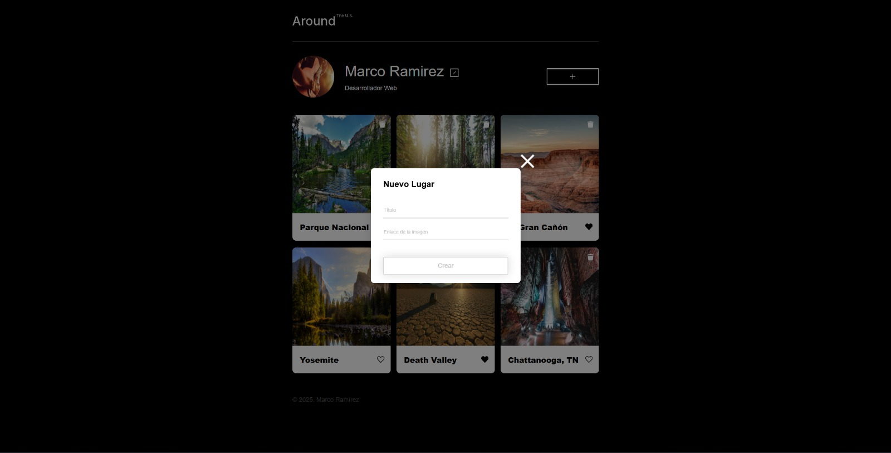
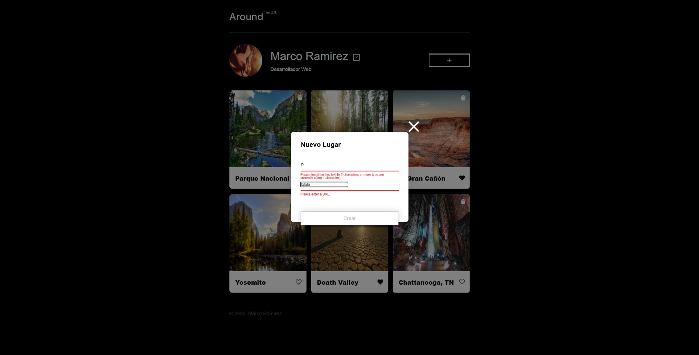

# Tripleten — Around U.S.

Es una aplicación web interactiva que muestra una colección de tarjetas con paisajes y lugares de interés.  
El proyecto se centra en la **dinámica del frontend, la comunicación con un servidor y una arquitectura limpia en JavaScript**, combinando diseño responsivo con consumo real de APIs.

Este proyecto fue desarrollado como parte del **programa de Desarrollo Web de Tripleten**.

---

## Preview

## Descripción del Proyecto

La aplicación permite a los usuarios:

- Visualizar tarjetas interactivas con imágenes y descripciones
- Renderizar contenido dinámicamente desde un servidor
- Agregar, modificar y actualizar información mediante llamadas a una API
- Interactuar con la interfaz de manera fluida y responsiva

El objetivo principal del proyecto es demostrar el manejo de **lógica frontend conectada a un backend real**, aplicando buenas prácticas en manipulación del DOM y gestión de datos.

---

## Tecnologías Utilizadas

- **HTML5**
- **CSS3**
  - Diseño responsivo
  - Flexbox y técnicas de layout
- **JavaScript (ES6+)**
  - Uso de clases
  - Código modular y mantenible
  - Operaciones asíncronas
- **API REST**
  - Comunicación con servidor
  - Autenticación basada en tokens

---

## Funcionalidades Principales

- Tarjetas interactivas con imágenes y títulos
- Renderizado dinámico de datos obtenidos desde el servidor
- Arquitectura basada en clases en JavaScript
- Integración con API para:
  - Obtener información
  - Modificar datos
  - Persistir cambios en el servidor
- Acceso seguro a la API mediante token personal
- Interfaz completamente responsiva

---

## Conocimientos Aplicados

- Estructura semántica en HTML
- Maquetación responsiva con CSS
- Sintaxis moderna de JavaScript (ES6+)
- Programación orientada a objetos (POO)
- Integración y manipulación del DOM
- Comunicación cliente–servidor
- Uso de métodos HTTP para operaciones CRUD

---
